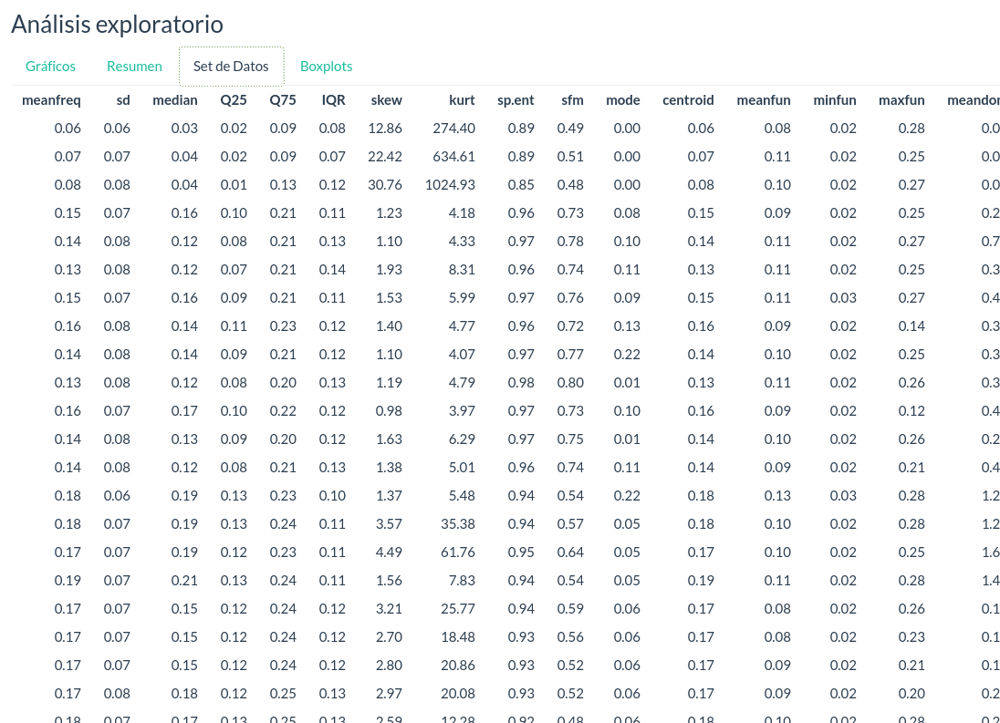

```{r setup, include=FALSE}
knitr::opts_chunk$set(echo = TRUE)
```

# Voice Gender Recognition

## Introduccion

  La voz es uno de los rasgos mas caracteristicos de cada persona, y muchas veces nos permite distinguir el sexo de alguien dadas las caracteristicas acusticas de su voz. Cabria entonces preguntarse: ¿Podria una maquina hacer lo mismo con una precision aceptable?Podria una maquina hacer lo mismo con una precision aceptable?


## Problema

  Se cuenta con un dataset de entrenamiento para obtener un modelo de clasificacion que permita hacer reconocimiento del sexo dadas las caracteristicas acusticas de la voz adulta.

- El dataset de entrenamiento contiene 3168 instancias y 21 parametros (columnas).

  De forma general, cada instancia consiste en un vector caracteristico que contiene 20 parametros.


## Parametros

Los parametros descritos son:

  - Frecuencia media (en kHz)
  - Desviacion estandar de la frecuencia
  - Frecuencia de la Mediana (en kHz)
  - Primer cuantil (en kHz)
  - Tercer cuantil (en kHz)
  - Rango intercuantil (en kHz)
  - Oblicuidad
  - Curtosis
  - Entropia Espectral
  - Llanura espectral
  - Frecuencia Modal
  - Centroide de la Frecuencia
  - Pico de frecuencia
  - Promedio de la frecuencia fundamental medido a traves de la se?al acustica
  - Minima frecuencia fundamental medida a traves de la se?al acustica
  - Maxima frecuencia fundamental medida a traves de la se?al acustica
  - Promedio de la frecuencia dominante medido a traves de la se?al acustica
  - Minima frecuencia dominante medida a traves de la se?al acustica
  - Maxima frecuencia dominante medida a traves de la se?al acustica
  - Rango de la frecuencia dominante medido a traves de la se?al acustica
  - Indice de modulacion
  - Etiqueta
  
  
## Aplicacion

  Nuestra aplicación cuenta con tres secciones principales, "Análisis exploratorio", "Configuración" y "Clasificación".
  


#### Análisis exploratorio


 En esta sección se presenta al usuario una vista del conjunto de datos sobre el cual se va a trabajar. Está compuesta de cuatro pestañas: 
 
- __Gráficos: el usuario puede elegir cuales variables graficar.__


- __Resumen: se presenta una vista general del conjunto de datos, sus características más resaltantes.__


- __Conjunto de datos: se visualizan los registros de la partición de prueba.__



- __Boxplots: al igual que en la sección de gráficos, es posible elegir entre dos variables.__


#### Configuración

  La aplicación ofrece la cinco algoritmos de clasificación, KNN, J48, Random Forest, SVM y Naive Bayes.
  
  - A la derecha se observa un resumen de los resultados del algoritmo seleccionado.
  
_Los algoritmo J48 y Random Forest ofrecen los mejores resultados_
  
  
  - Para cada uno de los algoritmos antes mencionados es posible modificar sus parámetros. Por ejemplo, para el caso de SVM se ofrece la opción de modificar la función kernel.
  


#### Clasificador

En esta sección el usuario podrá elegir entre las 950 instancias de la partición de prueba para clasificar. La aplicación entonces mostrará en pantalla los atributos de la instancia indicada, el resultado de su clasificación y como se clasifica realmente ese registro.


